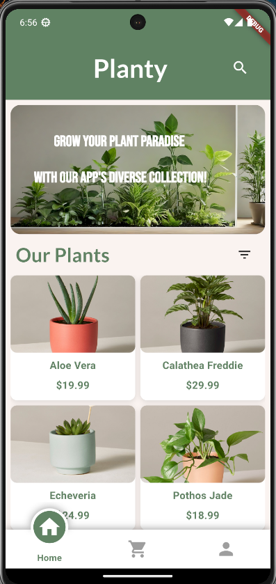
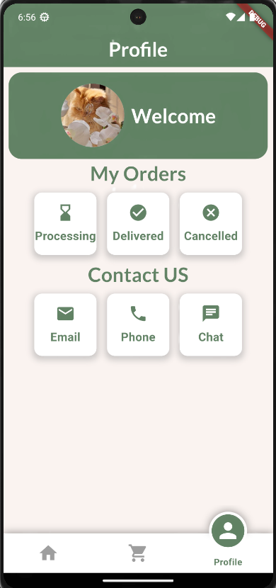
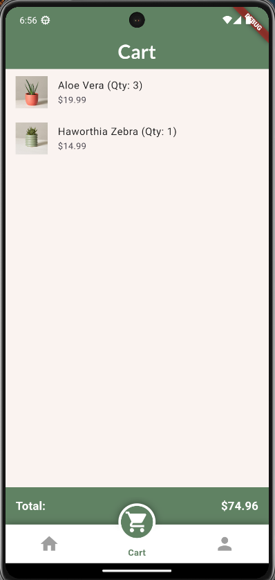
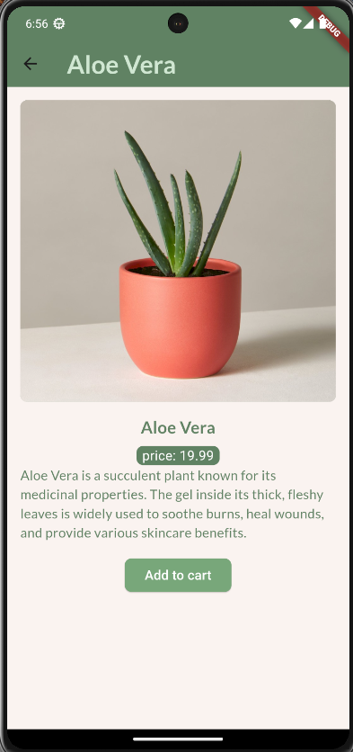

# Planty App

Planty is a Flutter application showcasing a collection of plants with details and categories.

## Table of Contents
- [Features](#features)
- [Screenshots](#screenshots)
- [Getting Started](#getting-started)
- [Dependencies](#dependencies)
- [How to Use](#how-to-use)

## Features
- View a collection of plants categorized into Indoor Plants, Succulents, and Outdoor Plants.
- Search for specific plants by name.
- View detailed information about each plant.
- Responsive design for a seamless user experience.

## Screenshots

## Getting Started
These instructions will help you set up and run the Planty app on your local machine.

### Prerequisites
- Ensure you have Flutter installed. If not, you can follow the instructions [here](https://flutter.dev/docs/get-started/install).

### Installation
1. Clone the repository.
   
   git clone https://github.com/arwaalkhathlan/planty.git

2. Navigate to the project directory.

   cd planty

3. Install dependencies

   flutter pub get

4. Run the App
   Run the following command in terminal to start the application

   flutter run

  
### Dependencies
 animation_search_bar: ^2.1.0
 google_fonts: ^2.2.0
 Make sure to check the pubspec.yaml file for the latest versions of the dependencies.

### How to Use
  1. Launch the app.
  2. Browse plants by category or search for specific plants.
  3. Click on a plant to view detailed information.
  4. you can add the plant to the cart and see the total

