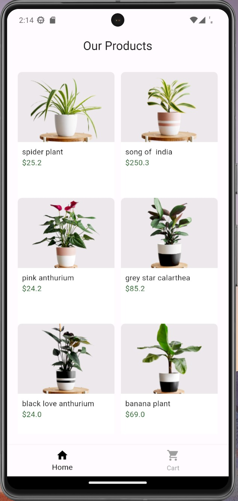
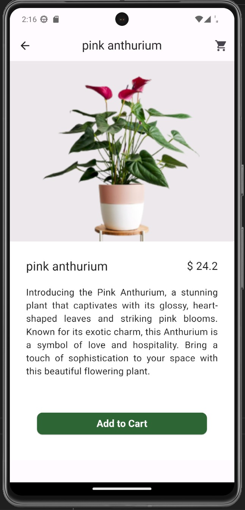
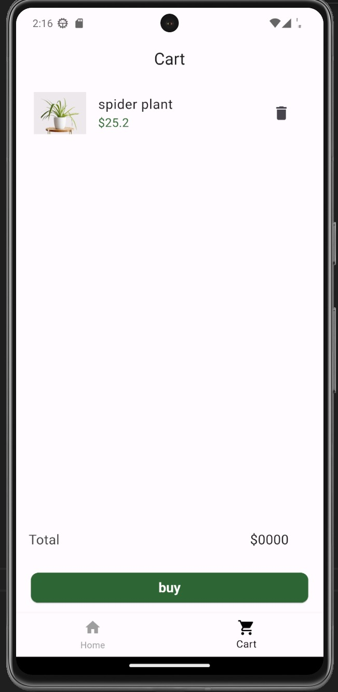

# flutter plant store app

## Project Overview
a simple E-Commerce app using flutter. The app use's the provider library for state management.

## Features

* brows product
* add product to the cart
* remove product from the cart

## Screenshots

    
